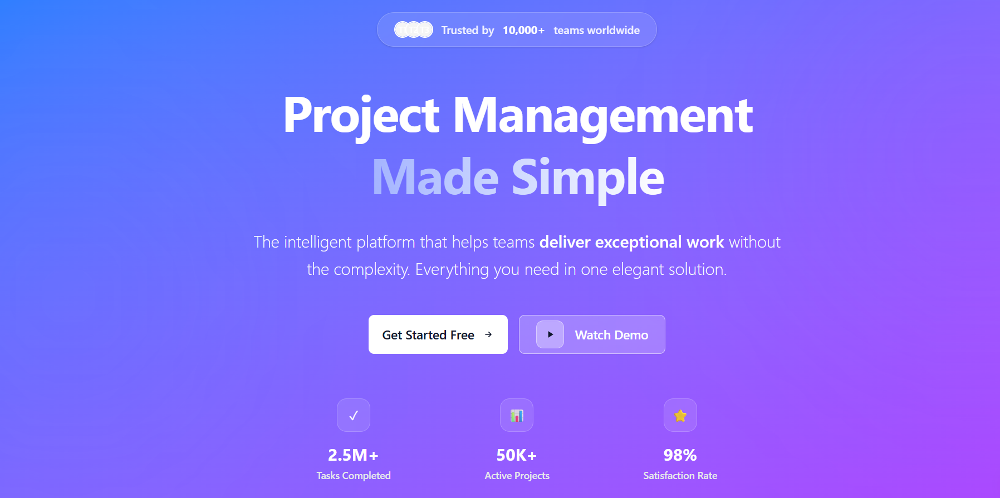
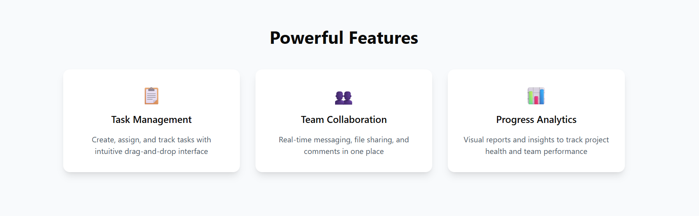
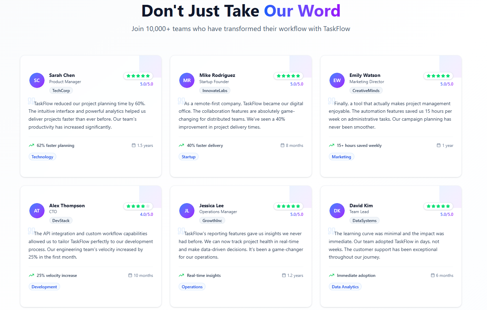
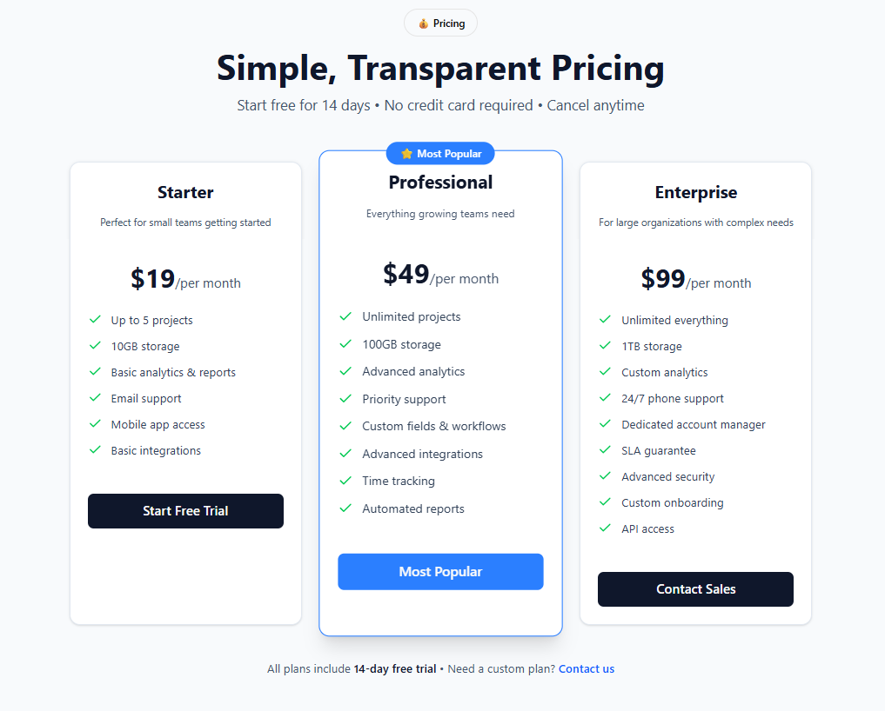
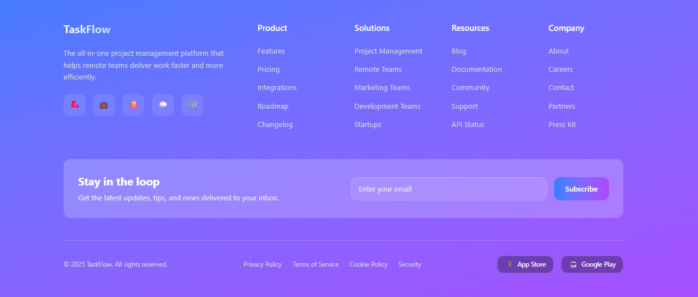

<div align="center">
  <br />
    <h1 align="center">Project Management Landing Page - TaskFlow </h1>

<br />

<div>


</div>

</div>


## <a name="introduction">✨ Introduction</a>

A modern, responsive landing page built with Next.js and Tailwind CSS for a project management SaaS product. This project was developed as part of a pre-internship assignment to demonstrate frontend development skills

## 🚀 Live Demo

[]((https://task-flow-psi-seven.vercel.app/))

## <a name="requirement">Assignment Requirements Met</a>
Hero Section with heading, subtext, and CTA buttons

-  Features Section with 3+ feature cards

-  Testimonials Section with customer reviews

-  Pricing Section with multiple plans

-  Footer with links and information

-  Next.js framework

-  Tailwind CSS for styling

-  Vercel v0 for component generation

-  Responsive Design for all screen sizes


## <a name="Technology Stack">🛠️ Technology Stack</a>

- Framework: Next.js 15.0.0

- Styling: Tailwind CSS

- UI Components: shadcn/ui

- Icons: Lucide React

- Deployment: Vercel

- UI Generation: Vercel v0  


## <a name="quick-start">🤸 Quick Start</a>

Follow these steps to set up the project locally on your machine.

**1. Clone the Repo**
```bash
git clone https://github.com/Amit-yadav099/TaskFlow.git
cd TaskFlow
```

**2. download the dependencies**
```bash
npm install
```

**3. Start the webApp**

```bash
npm run dev
```

The app will be live at http://localhost:3000
 

## <a name="Project-Structures">📁 Project Structure</a>
```bash
taskflow-landing/
├── app/
│   ├── components/
│   │   ├── HeroSection.js
│   │   ├── FeaturesSection.js
│   │   ├── TestimonialsSection.js
│   │   ├── PricingSection.js
│   │   └── Footer.js
│   ├── layout.js
│   ├── page.js
│   └── globals.css
├── components/
│   ├── ui/
│   │   ├── button.js
│   │   ├── card.js
│   │   ├── badge.js
│   │   ├── avatar.js
│   │   └── input.js
├── public/
│   └── avatars/
├── tailwind.config.js
├── next.config.js
└── package.json
```

## <a name="Images">Sample Images</a>






## <a name="vercel uaage">📱 Vercel v0 Usage</a>

- Components Generated with Vercel v0

  - The following sections were initially generated using Vercel v0 and then customized:

  - Hero Section: Generated with prompt "Modern hero section for project management SaaS with gradient background, headline, subheadline, and CTA buttons"

  - Features Section: Created using prompt "feature cards with icons, titles, and descriptions for project management software"

  - Testimonials Section: Generated with "Customer testimonial cards with ratings, avatars, and company information"

  -  Pricing Section: Built using "Three-tier pricing cards with feature lists and CTA buttons"

  - Footer Section: Created with "Modern footer with logo, links, and newsletter signup"

## <a name="my work">Customization Process</a>
After generating the initial components with Vercel v0, I have:

 - Enhanced the UI of testimonials and Inlclude the desingation and working background.
 
 - Improve the UI of hero section from simple color to blue-purple gradient

 - Improve the button structure with the help of schadcn UI

 -  Enhanced the layout and spacing for better visual differnces

 - Improved accessibility with proper semantic HTML

 - Optimized for performance and responsiveness
 
# <a name="Challenges">Challenges & Solutions</a>
- Challenge: Ensuring consistent spacing across sections

  - Solution: Used Tailwind's spacing scale and maintained consistent margins

- Challenge: Making testimonials section visually appealing

  - Solution: Implemented card-based layout with avatar, rating, and content separation

- Challenge: Responsive pricing cards

  - Solution: Used CSS Grid with responsive breakpoints and flexbox fallbacks

## <a name="Contribtuing">📌 Contributing</a>

Feel free to fork the repo, open issues, or submit PRs. Contributions are welcome!
